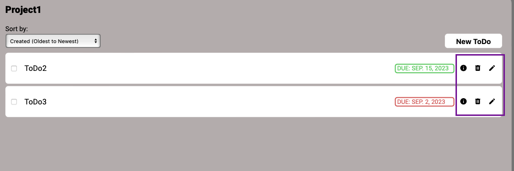
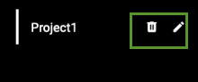

# ToDo List
This is a to-do list app that allows user to create to-dos'. [Link](https://jaizzer.github.io/todo-list/)

## Features
- New ToDo: Users can create to-dos which contain its **Title**, **Due Date** and **Priority**. There are also option information such as **Description** and **Notes**.
- Local Storage: Everything the user creates is saved only on that particular device.
- Projects: Users can organize their to-dos' through projects.
- Home: Users can create to-dos' right away in "Home" tab without needing to create new projects.
- Completed: Users can view all of their completed to-dos' in the "Completed" tab.
- Today: Users can view all of their to-dos' that are scheduled on current day.
- This Week: Users can view all of their to-dos' that are scheduled on current week.

## Getting Started
- You can access ToDo list by visiting the following link: [ToDoList](https://jaizzer.github.io/todo-list/).
- Alternatively, it can also be run locally by following this steps:
    1. Clone the repository in your local machine: 

        `git clone https://github.com/Jaizzer/todo-list`

    2. Navigate to the project directory in your terminal.
    3. When you're already inside `todo-list` directory install the project dependencies:

        `npm install`
    
    4. Once you've installed all dependencies, bundle the modules:

        `npm run build`
    
    5. Once bundled, go to the `dist` directory and open `index.html` file.

## Usage

1. Upon opening the page, you will see that it is divided into two equal section, the **dashoard** and the **to-do-window**. In the dashboard, you can access **Home**, **Completed**, **Today**, **This Week** and **Projects** tab.

    

2. To create a ToDo, you have two options. The first one is through **Home** tab.
Click **Home** and you will see **New ToDo** in the to-do window.

    

3. Once the form appeared, fill up all necessary informations. And click **Create ToDo**.

    

4. Now, the second way to create a to-do is by creating a project first. To create a project, click the **Projects** dropdown.

    

5. Then, you will see **Add Project** button. Click that and a form will appear asking you the project's name you want.

    

6. Afterwards, you will be sent to that project's corresponding to-do window, indicated by the project name on top of the to-do window. 

    

7. To create a to-do for that project, click **New ToDo** and do the same way as you did in **Home** tab.

8. There is a sort option to sort the to-dos' in the to-do window. You could sort by Date(due date), Name (alphabetical), Created (time created), and Priority level.
    
    

9. ToDo's you created will have a green-colored due date indicator if its not yet past its deadline. Otherwise, it will be red.

    

10. Tick the checkbox when you've completed the ToDo. This ToDo can now appear in the **Completed** tab.

    

11. You can view to-do's information through "i" icon, edit through "pen" icon, "delete" through trash icon.

    

13. You can delete project through "trash" icon and edit through "pen" icon. 

    

## Build with
- Vanilla CSS
- HTML
- Vanilla JavaScript
- NPM
- Webpack

## Contributing
Contributions to ToDo list are very welcome! If you find any bugs or have improvement suggestions, just open an issue on the GitHub repository. You can also fork the repository, make your changes, and then submit a pull request. 

You can email me via `@florenzjaizzer.calderon@gmail.com`.

## License
This project is licensed under the [MIT License](./LICENSE).